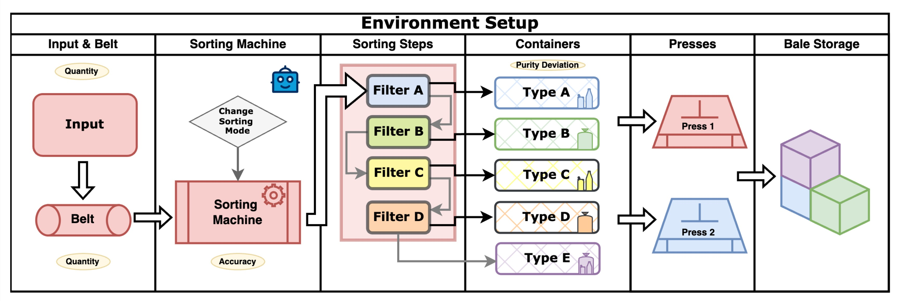

# Leveraging Genetic Algorithms for Efficient Demonstration Generation in Real-World Reinforcement Learning Environments

[](https://www.python.org/downloads/release/python-390/)
[](https://pypi.org/project/autopep8/)
[](https://opensource.org/licenses/MIT)
[](<(https://img.shields.io/badge/dependencies-up%20to%20date-brightgreen)>)

Reinforcement Learning (RL) has demonstrated significant potential
in industrial applications, yet its deployment in real-world environments remains
constrained by sample inefficiency and unstable learning dynamics. This study
investigates the utilization of Genetic Algorithms (GAs) as a mechanism for im-
proving RL performance in an industrially inspired sorting environment, charac-
terized by sequential decision-making and stochastic disturbances. We propose a
novel approach in which GA-generated expert demonstrations are used to en-
hance policy learning. These demonstrations are incorporated into a Deep Q-Net-
work (DQN) replay buffer for experience-based learning and utilized as warm-
start trajectories for Proximal Policy Optimization (PPO) agents to accelerate
training convergence. Our experiments compare standard RL training with rule-
based heuristics, brute-force optimization, and demonstration data, revealing that
GA-derived demonstrations significantly improve RL performance. Notably,
PPO agents initialized with GA-generated data achieved superior cumulative re-
wards, outperforming both purely learned RL policies and traditional optimiza-
tion techniques. These findings highlight the potential of hybrid learning para-
digms, where heuristic search methods complement data-driven RL, particularly
in complex, noisy, and resource-constrained industrial settings. The utilized
framework is publicly available and enables further research into adaptive RL
strategies for real-world applications.

---

## 📰 Publication

This work was submitted to and accepted at [LOD 2025](https://lod2025.icas.events/).

- You can read the [full paper on arXiv](https://arxiv.org/abs/2507.00762).

---

## 🤖 Environment-Design

This is the basic scheme of the [gymnasium](https://gymnasium.farama.org/index.html)-based environment, inspired by an industrial sorting process. For more details, see [Docs](docs/Environment.md).



---

## 🏗 Folder Structure

```
📦Sorting_Env_2024
 ┣ 📂docs
 ┣ 📂img
 ┣ 📂log
 ┣ 📂models
 ┣ 📂src
 ┃ ┣ 📜env.py                      # Main environment class for sorting simulation
 ┃ ┣ 📜testing.py                  # Functions for testing environments and models
 ┃ ┗ 📜training.py                 # Functions for training RL agents
 ┣ 📂utils
 ┃ ┣ 📜benchmark.py                # Benchmarking utilities for RL models
 ┃ ┣ 📜benchmark_models.py         # Functions to benchmark multiple models and policies
 ┃ ┣ 📜benchmark_testing.py        # Functions for detailed test benchmarks and purity plots
 ┃ ┣ 📜bruteforce.py               # Brute-force search for optimal action sequences
 ┃ ┣ 📜gen_brute_comp.py           # Compare genetic algorithm vs brute-force and other methods
 ┃ ┣ 📜genetic.py                  # Implementation of genetic algorithm for action search
 ┃ ┣ 📜plot_env_analysis.py        # Plotting and analysis tools for environment statistics
 ┃ ┣ 📜plotting.py                 # Main plotting functions for environment visualization
 ┃ ┗ 📜simulation.py               # Utilities for running and recording environment simulations
 ┣ 📜main.py                       # Main entry point: parameter setup and experiment runner
 ┣ 📜Readme.md                     # Project overview

---

## 📚 Setup

Follow these steps to set up the environment on your local machine.

```bash
git clone ______
cd ______

conda create -n sorting_env python=3.11
conda activate sorting_env
pip install -r ./docs/requirements.txt  # See also docs/requirements_conda.txt
```

---

## 🚀 Quickstart

To run the environment, you can use the `main.py` file. This file allows you to set the parameters for the environment and the agent. Alternatively, you can use the `main_cl.py` file, which allows you to set the parameters via the command line.

```bash
# Set parameters in the file and run the environment
python main.py
```

---

## Contact 📬

For questions or feedback, feel free to reach out to me at:

[📧 Tom.Maus@ini.rub.de](mailto:tom.maus@ini.rub.de)

---

